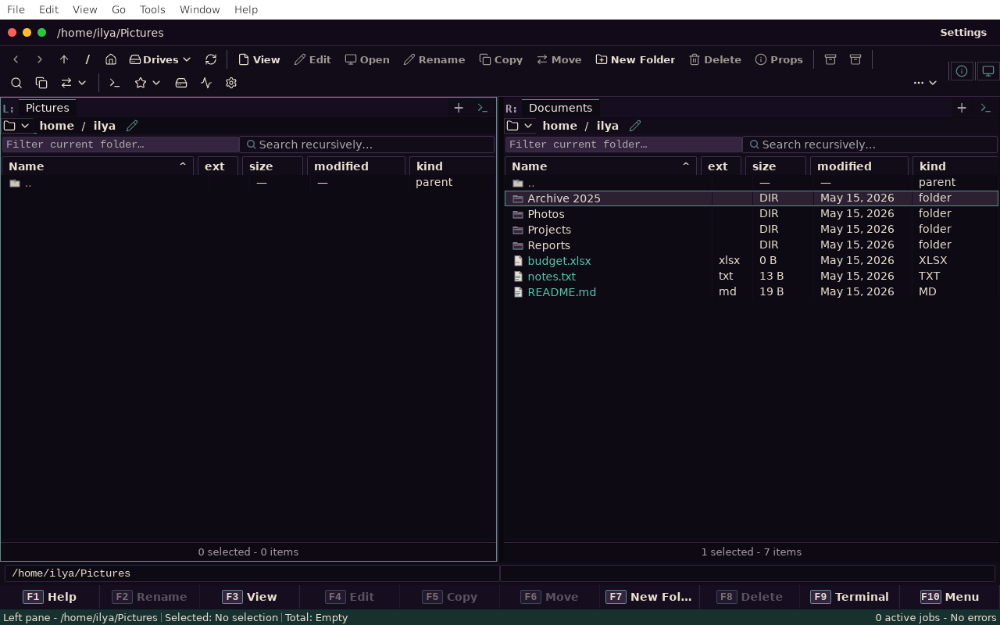
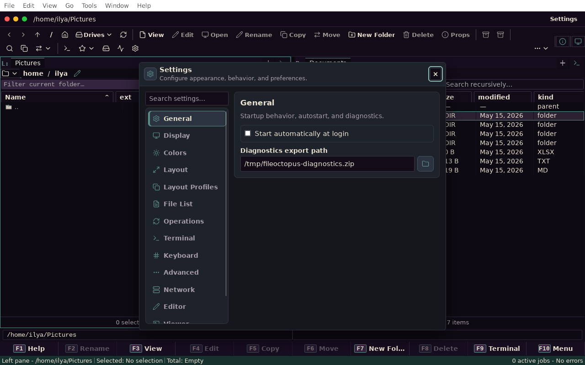
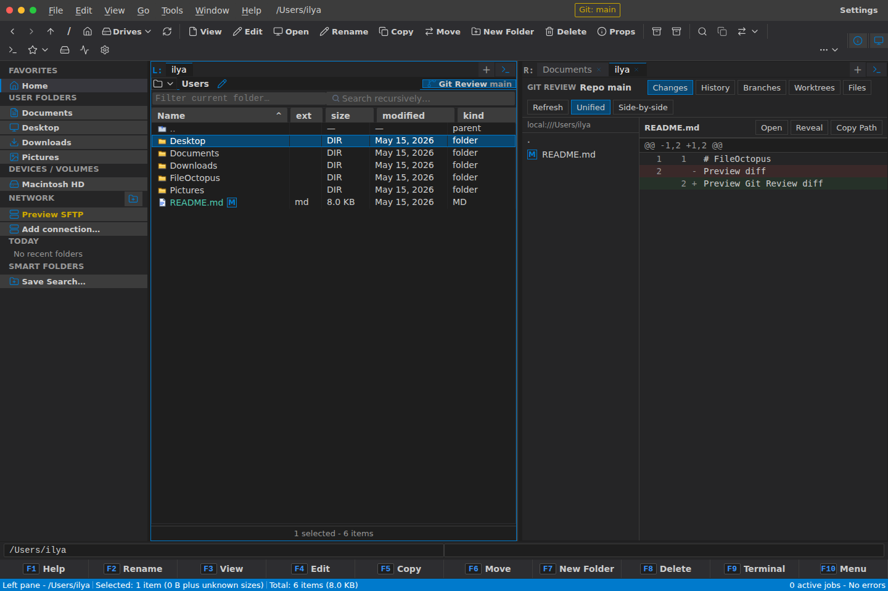
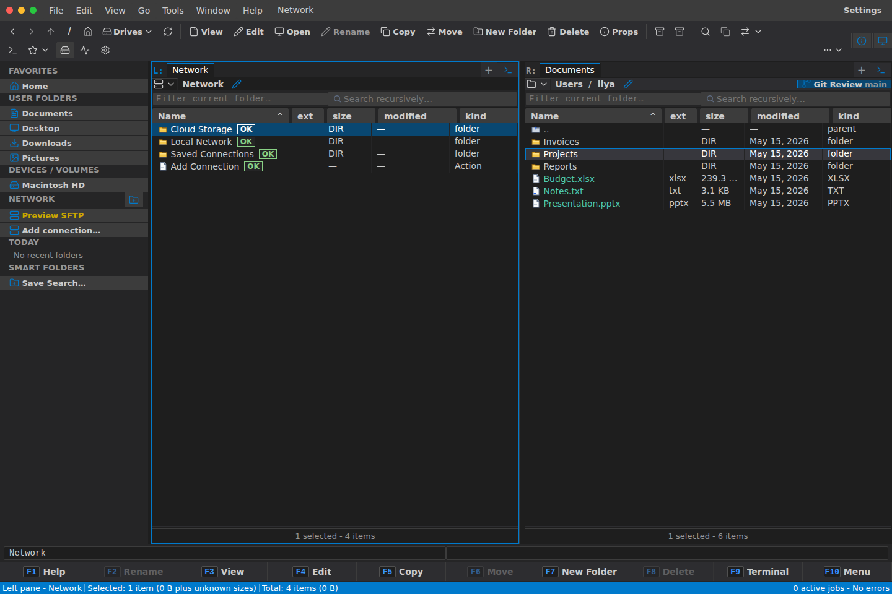
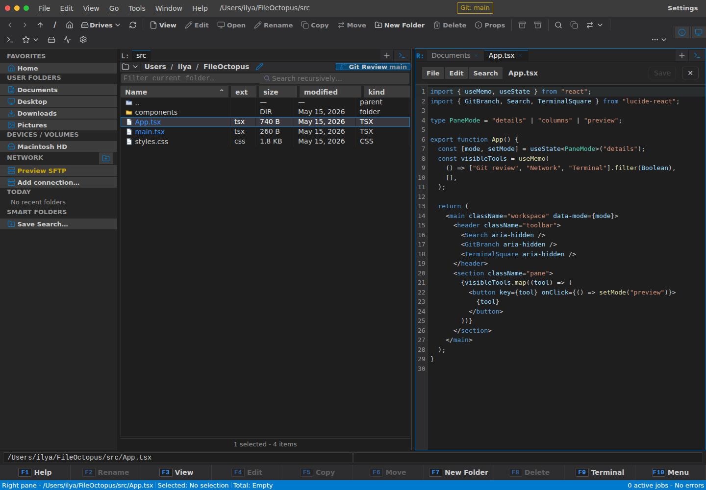
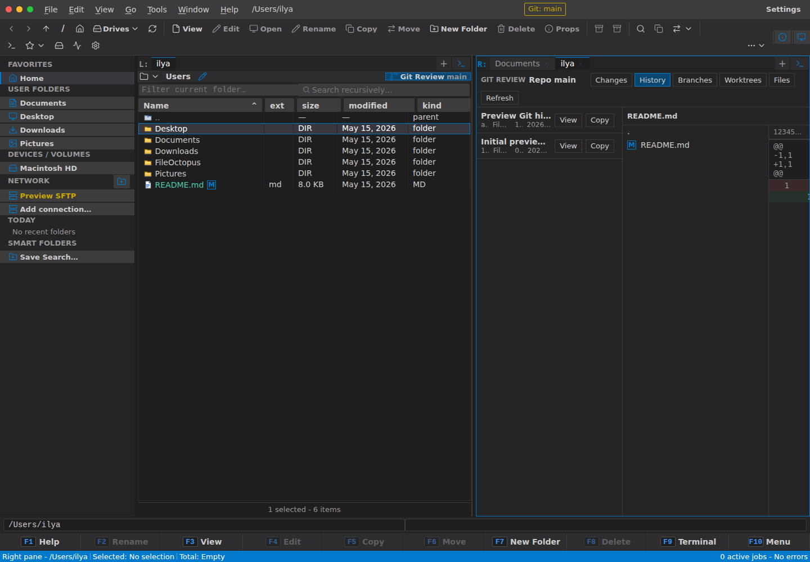
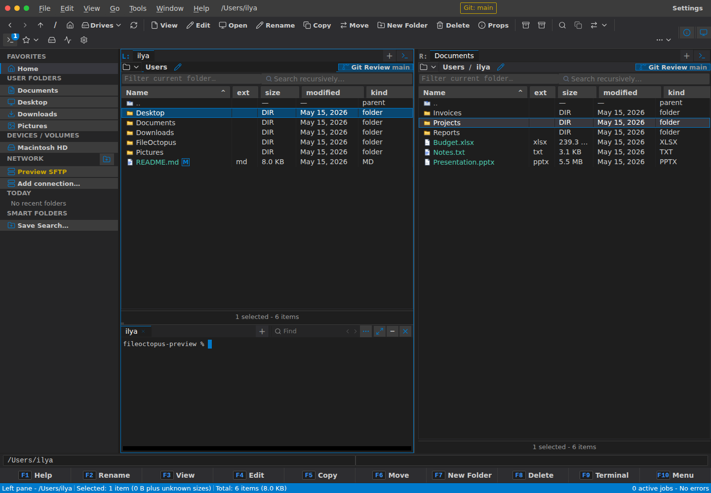
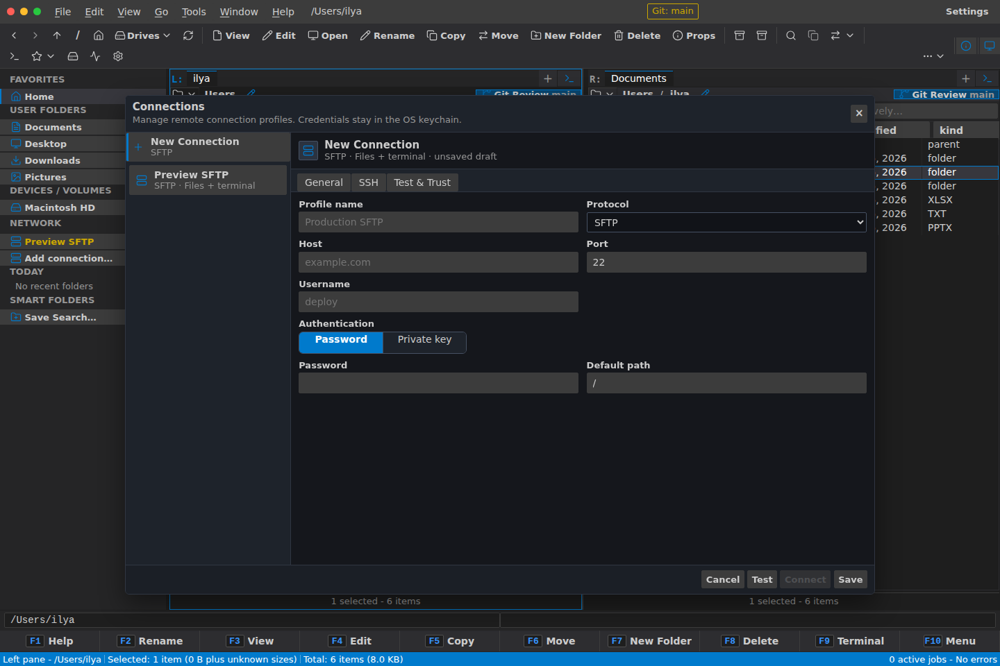

# FileOctopus

FileOctopus is a Tauri v2 desktop file manager with a Rust-owned filesystem
boundary and a React TypeScript frontend. It is designed for high-performance
local file operations, virtualized large-directory browsing, and safe job-based
execution.

## Status

FileOctopus is pre-1.0. Current release `v0.1.4` includes the core local
browsing, file operations, navigation, job progress, preferences, diagnostics,
Git status, embedded terminal, remote providers, cloud provider connectors,
plugins, archive browsing, previews, diff/merge, ACLs, and sync features present
on `main`.

See the [v0.1.4 release notes](docs/release-notes/v0.1.4.md) for supported
features, platform status, and known limitations.

## Interface Preview



| First-run setup                                                                    | Command palette                                                                         |
| ---------------------------------------------------------------------------------- | --------------------------------------------------------------------------------------- |
|  |  |

| Settings                                                                         | Jobs and activity                                                                       |
| -------------------------------------------------------------------------------- | --------------------------------------------------------------------------------------- |
|  |  |

| Git review                                                                         | Network locations                                                                           |
| ---------------------------------------------------------------------------------- | ------------------------------------------------------------------------------------------- |
|  |  |

| Syntax editor                                                                                   | Git history                                                                          |
| ----------------------------------------------------------------------------------------------- | ------------------------------------------------------------------------------------ |
|  |  |

| Integrated terminal                                                                                  |
| ---------------------------------------------------------------------------------------------------- |
|  |

| Add connection                                                                               |
| -------------------------------------------------------------------------------------------- |
|  |

Demo videos:

| Feature walkthrough                                                                                                        | Network and settings tour                                                                                                                          |
| -------------------------------------------------------------------------------------------------------------------------- | -------------------------------------------------------------------------------------------------------------------------------------------------- |
| [](docs/assets/videos/fileoctopus-demo.mp4) | [](docs/assets/videos/fileoctopus-settings-tour.mp4) |
| [Open MP4](docs/assets/videos/fileoctopus-demo.mp4)                                                                        | [Open MP4](docs/assets/videos/fileoctopus-settings-tour.mp4)                                                                                       |

## What Works Today

- Dual-pane browsing with virtualized large-directory rendering.
- `local://` resource URIs at the Rust-to-TypeScript trust boundary.
- Planned file operations: copy, move, rename, create folder/file, trash,
  permanent delete, archive create/extract, conflict handling, progress, cancel,
  pause/resume, and persisted operation history.
- Navigation: sidebar, favorites, devices, pinned locations, recent locations,
  starred items, breadcrumbs, editable path bar, back/forward/up.
- Views: details, list, icons, columns, sort/filter, recursive search, content
  search, folder size, file hash, and checksum verification.
- Preferences: theme, density, accent, font/icon scale, layout, operation,
  terminal, network, editor, viewer, diagnostics, shortcuts, and autostart.
- Git review: branch display, compact status badges, changed-file review, and
  unified/side-by-side worktree diffs.
- Remote workspace: SFTP, SMB, S3 profiles and Google Drive, Dropbox, OneDrive
  OAuth connector crates.
- Advanced tools: embedded local/SSH terminal, plugin marketplace, ACL editor,
  diff/merge, directory sync, archive browsing, saved searches, tags/labels,
  media/PDF/text previews, vertical split, and storage gauge.

## Current Limitations

- Rubber-band select.
- EXIF metadata display.
- Trash browser/restore.
- AI semantic search and peer-to-peer sync are intentionally deferred.

## Prerequisites

- Rust via `rustup`
- Node.js
- pnpm 10.26.2+ (`corepack enable` recommended)
- Platform prerequisites for Tauri v2

## Quick Start

```bash
pnpm install
pnpm bootstrap
pnpm dev
```

## Development Commands

```bash
# TypeScript / frontend
pnpm dev
pnpm build
pnpm typecheck
pnpm lint
pnpm format:check
pnpm test

# Rust / backend
pnpm rust:check
pnpm rust:test
pnpm rust:fmt
pnpm rust:clippy

# Release candidate
pnpm rc:validate
pnpm tauri:build
```

## Project Layout

- `apps/desktop-tauri` - Tauri v2 shell and React wrapper.
- `apps/cli` - placeholder CLI app.
- `crates/` - Rust domain, IPC, jobs, filesystem, platform, terminal, remote,
  provider, plugin, telemetry, config, and test-support crates.
- `packages/` - `@fileoctopus/frontend`, `@fileoctopus/ui`, and
  `@fileoctopus/ts-api`.
- `docs/` - architecture, ADRs, API reference, security, release, testing, and
  usage docs.

## Architecture

- [API reference](docs/architecture/api-reference.md) - IPC commands, events,
  DTOs, and error catalog.
- [Architecture index](docs/architecture/README.md) - module docs and routing.
- [ADRs](docs/adr/README.md) - design decisions.
- [Security notes](docs/security/README.md) - security model and audit guidance.

Boundary invariants: `local://` URIs only for filesystem resources, no
unrestricted frontend filesystem access, mutating work through planned jobs, and
mirrored Rust/TypeScript IPC DTOs.

## Testing

```bash
cargo run -p test-support --bin fileoctopus-test-tree -- --root ./tmp/100k --files 100000 --dirs 0
pnpm --filter @fileoctopus/frontend test
pnpm rc:validate
```

See [Testing](docs/testing/README.md) and [Performance](docs/performance.md).

## Contributing

See [CONTRIBUTING.md](CONTRIBUTING.md). Pull requests should include a summary,
tests, and security impact. Filesystem, IPC, permission, terminal,
remote-provider, or plugin boundary changes need explicit review notes.

## Security

Please report vulnerabilities through GitHub private vulnerability reporting.
See [SECURITY.md](SECURITY.md).

## License

FileOctopus is licensed under the [MIT License](LICENSE).
