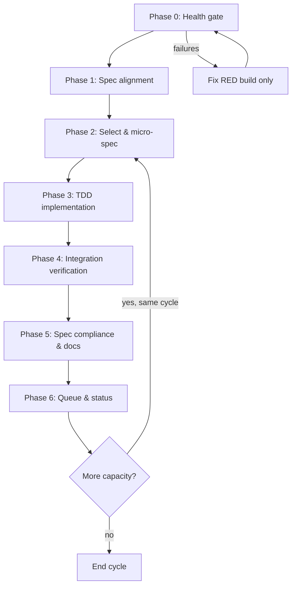

# FileOctopus Cronjob Workflow

## Purpose

This document is the **operating procedure** for the automated (4-hourly) and manual development cycles on FileOctopus. The cron agent reads it end-to-end each run.

Goals:

1. Drive the product from **specification → tested implementation → verified delivery** until MVP acceptance criteria are met.
2. Enforce **Test-Driven Development (TDD)** on every behavior change.
3. Enforce **specification-driven** work: no feature without a traced requirement and acceptance check.

---

## Lifecycle Overview

Each cycle is one pass through the full loop. Do not skip phases.



**Iron rule:** If Phase 0 fails, the cycle only fixes build/test/lint failures (still using TDD for bugfixes). No new features until green.

---

## State Files

| File                                                | Role                                                                |
| --------------------------------------------------- | ------------------------------------------------------------------- |
| `docs/plans/CRON_STATUS.md`                         | Written every run: checks, commits, spec compliance, deferred items |
| `docs/plans/CRON_TASKS.md`                          | Queue: `pending` → `in_progress` → `done`                           |
| `docs/planning/PROJECT_STATUS_AND_DOC_ALIGNMENT.md` | Authoritative delivery matrix; update when MVP/UI status changes    |
| `docs/architecture/api-reference.md`                | IPC contract; update with every boundary change                     |

---

## Specification Hierarchy (read before coding)

Trust order for “what should exist” vs “what exists today”:

| Priority | Document                                                                      | Use for                                                                                |
| -------- | ----------------------------------------------------------------------------- | -------------------------------------------------------------------------------------- |
| 1        | `docs/architecture/api-reference.md`                                          | Commands, events, DTOs, error codes                                                    |
| 2        | `docs/architecture/rc-engineering-spec.md`                                    | RC scope, milestones (§5), acceptance IDs (§4), testing (§13)                          |
| 3        | `docs/planning/PROJECT_STATUS_AND_DOC_ALIGNMENT.md`                           | Current delivery vs specs                                                              |
| 4        | `docs/plans/FileOctopus_Menu_and_Modal_Specification.md`                      | Menus, modals, shortcuts                                                               |
| 5        | `docs/FileOctopus_UI_Design_and_Layout_Specification-1.md`                    | Layout architecture, visible surfaces, acceptance (§27), implementation priority (§28) |
| 6        | `docs/planning/UI_FEATURE_INVENTORY.md`                                       | Coverage checklist                                                                     |
| 7        | `docs/qa/e2e-audit-report.md`                                                 | Manual QA hints (may be stale—verify in code)                                          |
| 8        | `~/.hermes/skills/dogfood/fileoctopus-dev/references/gap-analysis-2026-05.md` | Backlog ideas (sync to alignment doc)                                                  |

Reference images: `docs/Images/MainApp/`, `docs/Images/MenuImages/`.

---

## Phase 0: Health Gate

Run from repo root:

```bash
bash scripts/health-check.sh
```

Or run checks individually:

```bash
git status --short
pnpm typecheck
pnpm rust:check
pnpm test
pnpm rust:test
pnpm lint
pnpm rust:fmt    # optional each cycle; required before merge-quality commits
pnpm rust:clippy # optional each cycle; required before merge-quality commits
```

**E2E (when UI/visual work):** start dev server (`pnpm dev` or Vite on `:1420`), then Playwright if configured.

Record results in `CRON_STATUS.md`. Any failure blocks feature work.

---

## Phase 1: Specification Alignment

Before selecting new work:

1. Read **PROJECT_STATUS_AND_DOC_ALIGNMENT.md** — note open milestones (especially M4: Git, archives, terminal).
2. Scan **MVP §4 acceptance criteria** — list IDs still `Not met` / `Partial`.
3. Cross-check **CRON_TASKS.md** and gap analysis for duplicates.
4. For UI tasks, read `docs/FileOctopus_UI_Design_and_Layout_Specification-1.md` §27–§28, then open the relevant Menu/UI spec section and reference PNGs.
5. For UI tasks, identify the current UI implementation phase before coding:
   - Phase 1: shell cleanup and layout baseline
   - Phase 2: pane usability
   - Phase 3: command surfaces
   - Phase 4: preferences and dialogs
   - Phase 5: polish and QA

Output (mental or in status): _which acceptance IDs this cycle could close_.

---

## Phase 2: Select Work & Write a Micro-Spec

### Task priority

1. Fix failing tests / TypeScript / Rust / lint (TDD bugfix loop).
2. Close **MVP acceptance criteria** marked not met (highest user impact first).
3. Items in **CRON_TASKS.md** (`pending`, by priority).
4. **Tier 1–2** gaps in `docs/plans/2026-05-16-gap-analysis-and-implementation.md` (verify not already done).
5. Spec compliance gaps (menu/UI inventory).
6. Visual regression vs `docs/Images/` (Playwright).
7. Documentation drift (implementation changed contract).

Pick **one primary feature slice** per cycle unless the slice is trivial (<30 min). Mark task `in_progress` in `CRON_TASKS.md`.

### UI implementation order (required for UI slices)

When the selected slice is primarily UI/layout work, sequence it according to `docs/FileOctopus_UI_Design_and_Layout_Specification-1.md` §28:

1. **Phase 1 — Shell cleanup and layout baseline:** remove always-visible diagnostics, stabilize `AppShell`/`Sidebar`/`PaneWorkspace`/`FilePane`/`StatusBar`, implement active-pane styling, define theme/density tokens.
2. **Phase 2 — Pane usability:** redesign toolbar groups, improve breadcrumb/path bar, stabilize file-table columns, standardize pane states, fix status-bar accuracy.
3. **Phase 3 — Command surfaces:** add file/empty-space/sidebar/breadcrumb context menus, wire toolbar dropdowns, ensure top-menu commands target the active pane.
4. **Phase 4 — Preferences and dialogs:** add settings, theme/density/view/hidden-file preferences, keyboard shortcuts, diagnostics, properties, and operation dialogs.
5. **Phase 5 — Polish and QA:** add visual regression coverage, keyboard interaction tests, accessibility pass, and cross-platform/window-size validation.

Do not start a later UI phase while earlier-phase blockers for that surface remain unresolved unless `CRON_STATUS.md` records the reason.

### Micro-spec template (required before Phase 3)

For the chosen slice, write (in run notes or a dated plan under `docs/plans/`):

```markdown
## Feature: <short name>

### Requirements

- Spec: <doc> §<section>
- Acceptance: <MVP-XXX-NNN or UI inventory id>
- Out of scope: <explicit exclusions>

### Behavior

- Given … When … Then …

### Test plan (TDD)

- Rust: `crates/<crate>/tests/<name>.rs` — <cases>
- TS: `packages/<pkg>/tests/<name>.test.ts` — <cases>
- Integration / perf: <if §13 requires>

### Files (expected)

- Rust: vfs | fs-core | app-ipc | app-core | desktop-tauri
- TS: ts-api types + `clients/*` + `commandMap.ts` | frontend components

### IPC / boundary

- [ ] No new command OR new command mirrored: app-ipc, api-reference, types.ts, clients/_.ts, commandMap.ts, commands/_.rs + lib.rs registration
- [ ] URIs are `local://` only at boundary
- [ ] Stable error codes from VfsError / FileOperationError
```

Do not write production code until the micro-spec and **first failing test name** exist.

---

## Phase 3: TDD Implementation Loop

### Non-negotiable rules

1. **No production code without a failing test first.** If code was written before the test, delete the implementation and restart from the test.
2. **Verify RED:** run the new test alone; confirm it fails for the _expected_ reason (not a typo or import error).
3. **Verify GREEN:** run the narrowest test scope, then the full package/workspace tests.
4. **Refactor only while green.** Run tests again after refactor.

### RED → GREEN → REFACTOR

| Step         | Action                                  | Command examples                                                                        |
| ------------ | --------------------------------------- | --------------------------------------------------------------------------------------- |
| RED          | One minimal test per behavior           | `cargo test -p vfs test_name` / `pnpm --filter @fileoctopus/frontend test -- -t "name"` |
| Verify RED   | Must fail correctly                     | Read failure message; fix test if wrong failure                                         |
| GREEN        | Minimal code to pass                    | Same narrow command                                                                     |
| Verify GREEN | All related tests pass                  | `pnpm test`, `cargo test -p <crate>`                                                    |
| REFACTOR     | Clean names, dedupe, no behavior change | Re-run same tests                                                                       |

### Where to put tests (MVP §13)

| Layer            | Location                                                | When                                      |
| ---------------- | ------------------------------------------------------- | ----------------------------------------- |
| Rust domain      | `crates/vfs/tests/`, `crates/fs-core/tests/`            | URIs, planning, conflicts, archive safety |
| Rust integration | `crates/*/tests/` integration files                     | Copy/move/trash/extract flows             |
| IPC contract     | Extend existing `app-ipc` / handler tests               | DTO serde, command wiring                 |
| TS API           | `packages/ts-api/tests/*.test.ts`                       | Client, error normalization               |
| Frontend         | `packages/frontend/tests/` or colocated `*.test.ts`     | Panel, shortcuts, dialogs, palette        |
| Performance      | `cargo run -p test-support --bin fileoctopus-test-tree` | §13.4 scenarios when touching listing/ops |

Prefer **real behavior** over heavy mocks. One assertion focus per test when practical.

### Specification-driven implementation order

For a typical **cross-boundary feature**, implement in this order (each step = TDD cycle):

1. **Domain (`vfs`)** — types, errors, traits if new concepts.
2. **Executor (`fs-core`)** — plan/execute, conflict, progress.
3. **IPC (`app-ipc` + `commands/<domain>.rs` + `lib.rs` registration)** — DTOs, command, events.
4. **TS API (`ts-api`)** — types, `commandMap.ts`, method on `clients/<domain>.ts`, tests.
5. **UI (`frontend`)** — wire control; keyboard shortcut if spec requires.
6. **Docs** — `api-reference.md`, alignment matrix, micro-spec marked done.

For **frontend-only** features (data already in DTO): start tests in `frontend` or `ts-api`, then UI.

### Boundary checklist (every IPC change)

- [ ] `ResourceUri` / `local://` at all boundaries (ADR-0003)
- [ ] Mutations go through plan/start jobs where applicable (ADR-0002)
- [ ] `#[serde(rename_all = "camelCase")]` matches `types.ts`
- [ ] Error `code` strings stable and documented in api-reference
- [ ] Event names match `app_ipc` constants and `packages/ts-api/src/events.ts` listeners

---

## Phase 4: Integration Verification

After the feature slice is green at unit level:

```bash
bash scripts/health-check.sh
```

Additional gates when relevant:

| Change type              | Extra verification                                        |
| ------------------------ | --------------------------------------------------------- |
| Rust public API          | `pnpm rust:clippy`, `pnpm rust:fmt`                       |
| Listing / virtualization | Perf protocol tree under `tmp/100k` (see `docs/testing/`) |
| UI layout / menus        | Playwright or manual compare to `docs/Images/`            |
| Archive / security       | MVP-ARC-002 / MVP-REL-005 scenarios in §13.2              |

Do not mark task `done` until health gate passes.

---

## Phase 5: Specification Compliance & Documentation

1. **Acceptance mapping:** In `CRON_STATUS.md`, state which MVP/UI criteria the slice satisfies (or partially satisfies). For UI work, map the slice to `docs/FileOctopus_UI_Design_and_Layout_Specification-1.md` §27 acceptance criteria and §28 implementation phase.
2. **Spec diff:** If behavior matches spec but doc was wrong, update the spec or alignment doc—not silent drift.
3. **IPC:** Update `docs/architecture/api-reference.md` for any command/event/DTO change.
4. **Alignment:** Update `PROJECT_STATUS_AND_DOC_ALIGNMENT.md` when a milestone or acceptance row changes state.
5. **Inventory:** Tick relevant rows in `UI_FEATURE_INVENTORY.md` when appropriate.

### Commit policy

- Use Conventional Commits: `feat:`, `fix:`, `test:`, `docs:`, `chore:`.
- One logical slice per commit; include tests in the same commit as behavior.
- Do not commit secrets or local `tmp/` trees.

---

## Phase 6: Queue & Status Update

Update **`docs/plans/CRON_TASKS.md`:**

- Mark completed task `done` with date and commit hash.
- Add newly discovered `pending` tasks (P1–P3, description, files, acceptance ID).
- Keep at most one `in_progress` task.

Update **`docs/plans/CRON_STATUS.md`:**

| Section                 | Content                            |
| ----------------------- | ---------------------------------- |
| Last run timestamp      | UTC                                |
| Build & tests table     | From health-check                  |
| Work completed          | Feature, acceptance IDs, commit    |
| Spec compliance summary | Menus, columns, shortcuts, stubs   |
| TDD evidence            | Tests added; RED verified (yes/no) |
| Deferred                | Next cycle with priority           |

If capacity remains and Phase 0 is still green, return to **Phase 2** for a second slice; otherwise end cycle.

---

## Full Project Completion Criteria

The cron loop continues until:

- [ ] All **MVP §4.1** functional acceptance criteria **Met**
- [ ] **MVP §4.2** performance targets validated per `docs/testing/` protocol
- [ ] **MVP §4.3** reliability criteria covered by automated tests where feasible
- [ ] **MVP §13** test lists implemented (not merely stubbed)
- [ ] **Milestone M4–M5** rows in alignment doc marked **Done**
- [ ] `docs/FileOctopus_UI_Design_and_Layout_Specification-1.md` §27 acceptance criteria met or explicitly deferred with tracked follow-up work
- [ ] Menu spec **application menu bar** delivered or explicitly deferred with ADR
- [ ] `CRON_TASKS.md` has no P1 `pending` items
- [ ] `bash scripts/health-check.sh` exits 0 on clean `main`

---

## Quick Reference: Commands

```bash
# Full gate
bash scripts/health-check.sh

# Single Rust test
cargo test -p <crate> <test_name>

# Single Vitest test
pnpm --filter @fileoctopus/frontend test -- -t "<test name>"

# Perf fixture
cargo run -p test-support --bin fileoctopus-test-tree -- --root ./tmp/100k --files 100000 --dirs 0
```

---

## Anti-Patterns (do not)

- Implement first, test later.
- Skip RED verification (“test passed immediately” without prior failure).
- Pick tasks with no spec/acceptance ID traceability.
- Add IPC handlers without `ts-api` + api-reference updates.
- Trust stale audit/inventory rows without code verification.
- Mark tasks `done` while health-check fails.
- Large multi-feature commits without tests.

---

## Current Baseline (2026-05-16)

Snapshot for agents; refresh in `CRON_STATUS.md` each run:

- Health: vitest + `cargo test` green; TypeScript clean; Rust check OK
- Branch: `main`
- Known stubs: Compress / Extract / Checksum toolbar (need archive/checksum backend per MVP-ARC / gap Tier 3)
- Open milestone: **M4** (Git, archives, embedded terminal), **M5** hardening

See `CRON_TASKS.md` for the active queue.
