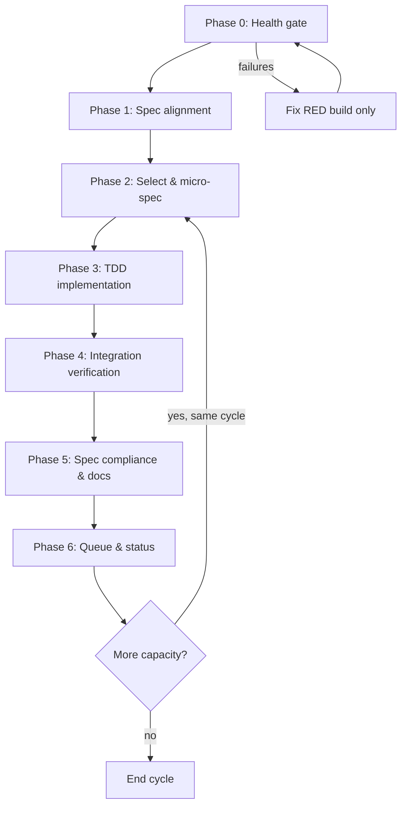

# FileOctopus Cronjob Workflow

## Purpose

This document is the **operating procedure** for the automated (4-hourly) and manual development cycles on FileOctopus. The cron agent reads it end-to-end each run.

Goals:

1. Drive the product from **specification → tested implementation → verified delivery** until RC acceptance criteria are met.
2. Enforce **Test-Driven Development (TDD)** on every behavior change.
3. Enforce **specification-driven** work: no feature without a traced requirement and acceptance check.

---

## Lifecycle Overview

Each cycle is one pass through the full loop. Do not skip phases.



**Iron rule:** If Phase 0 fails, the cycle only fixes build/test/lint failures (still using TDD for bugfixes). No new features until green.

---

## State Files

| File                                                | Role                                                                                              |
| --------------------------------------------------- | ------------------------------------------------------------------------------------------------- |
| `docs/plans/CRON_STATUS.md`                         | Latest run record; rewritten every cycle with gate results, TDD evidence, and deferred follow-ups |
| `docs/plans/CRON_TASKS.md`                          | Execution queue; only `Active RC Queue` is eligible for autonomous task selection                 |
| `docs/planning/PROJECT_STATUS_AND_DOC_ALIGNMENT.md` | Authoritative delivery matrix; update when RC/UI status changes                                   |
| `docs/architecture/api-reference.md`                | IPC contract; update with every boundary change                                                   |

---

## Specification Hierarchy (read before coding)

Trust order for “what should exist” vs “what exists today”:

| Priority | Document                                                   | Kind  | Use for                                                                                |
| -------- | ---------------------------------------------------------- | ----- | -------------------------------------------------------------------------------------- |
| 1        | `docs/architecture/api-reference.md`                       | Spec  | Commands, events, DTOs, error codes                                                    |
| 2        | `docs/architecture/rc-engineering-spec.md`                 | Spec  | RC scope, milestones (§5), acceptance IDs (§4), testing (§13)                          |
| 3        | `docs/planning/PROJECT_STATUS_AND_DOC_ALIGNMENT.md`        | State | Current delivery vs specs                                                              |
| 4        | `docs/plans/FileOctopus_Menu_and_Modal_Specification.md`   | Spec  | Menus, modals, shortcuts                                                               |
| 5        | `docs/FileOctopus_UI_Design_and_Layout_Specification-1.md` | Spec  | Layout architecture, visible surfaces, acceptance (§27), implementation priority (§28) |
| 6        | `docs/planning/UI_FEATURE_INVENTORY.md`                    | State | Coverage checklist                                                                     |
| 7        | `docs/archive/e2e-audit-report.md`                         | State | Manual QA hints (may be stale—verify in code)                                          |

**Spec rows** describe what should exist; **State rows** describe what does. When they disagree, trust code + tests over either — and fix whichever row is wrong in Phase 5.

**Dated plans under `docs/plans/2026-*.md` are immutable historical records.** Do not pull tasks from them; surface any still-relevant findings into `CRON_TASKS.md` and let the dated plan rot in place.

Reference images: `docs/Images/MainApp/`, `docs/Images/MenuImages/`.

---

## Phase 0: Health Gate

### Phase 0a: Sync & resume

Before any checks, reconcile with upstream and clean up any interrupted prior cycle:

```bash
git fetch origin
git status -sb               # inspect ahead/behind + uncommitted changes
```

- **Behind `origin/main`:** rebase before any new work. Investigate any merge conflict; never `git reset --hard` to "make it go away".
- **Ahead of `origin/main` with unpushed commits:** investigate why before continuing — a prior cycle may have committed but not pushed, or an earlier slice was abandoned.
- **Uncommitted changes present:** inspect `git diff --name-only`. If every changed path is workflow/doc maintenance (`docs/plans/CRON*.md`, trusted status/spec docs, or `scripts/health-check.sh`), record this as `maintenance` in `CRON_STATUS.md` and continue without selecting product work. Otherwise, scan `CRON_TASKS.md` for an `in_progress` row whose `Run ID` or `Owner` matches the current changes.
- **Matching `in_progress` task found:** finish that slice first (jump to Phase 3 for the current micro-spec in `CRON_STATUS.md`).
- **No matching task found:** treat this as orphan state. Record the dirty files in `CRON_STATUS.md` and stop until a human resolves it.
- **`in_progress` task with no matching uncommitted changes:** if `Lock Expires UTC` is in the past, clear `Owner`, `Run ID`, `Started UTC`, and `Lock Expires UTC`, then mark it `pending`. If the lock has not expired, stop and record the active owner/run in `CRON_STATUS.md`.
- **Lockfile changed during fetch/rebase:** if `pnpm-lock.yaml` or any `Cargo.lock` moved, run `pnpm install` before Phase 0b — stale `node_modules` will produce misleading typecheck/lint results.

### Phase 0b: Health checks

Run from repo root:

```bash
bash scripts/health-check.sh
```

Or run checks individually:

```bash
git status --short
pnpm typecheck
pnpm rust:check
pnpm test
pnpm rust:test
pnpm lint
pnpm rust:fmt    # optional each cycle; required before merge-quality commits
pnpm rust:clippy # optional each cycle; required before merge-quality commits
```

`git status --short` is informational only. A dirty tree does not fail Phase 0, but it must be recorded and must not be overwritten.

**E2E:** run when `apps/desktop-tauri/playwright.config.ts` (or equivalent) exists **and** the upcoming slice touches `packages/frontend/src/` or `apps/desktop-tauri/src/`. Start dev server (`pnpm dev` or Vite on `:1420`) first.

Record results in `CRON_STATUS.md`. Any failure blocks feature work.

---

## Phase 1: Specification Alignment

Before selecting new work:

1. Read **PROJECT_STATUS_AND_DOC_ALIGNMENT.md** — note open milestones (especially M5 hardening and any RC rows still marked partial).
2. Scan **RC spec §4 acceptance criteria** — list IDs still `Not met` / `Partial`.
3. Cross-check **CRON_TASKS.md** and higher-trust docs for stale or duplicate rows.
4. For UI tasks, read `docs/FileOctopus_UI_Design_and_Layout_Specification-1.md` §27–§28, then open the relevant Menu/UI spec section and reference PNGs.
5. For UI tasks, identify the current UI implementation phase before coding:
   - Phase 1: shell cleanup and layout baseline
   - Phase 2: pane usability
   - Phase 3: command surfaces
   - Phase 4: preferences and dialogs
   - Phase 5: polish and QA

Output (in status): _which acceptance refs this cycle could close_.

---

## Phase 2: Select Work & Write a Micro-Spec

### Task priority

1. Fix failing tests / TypeScript / Rust / lint (TDD bugfix loop).
2. Close **RC acceptance criteria** marked `Not met` / `Partial` (highest user impact first).
3. Items in **`docs/plans/CRON_TASKS.md` → `Active RC Queue`** (`pending`, by priority).
4. Verified spec compliance gaps not yet in the queue; report them in `CRON_STATUS.md` and wait for human reprioritization before implementation.
5. Visual regression vs `docs/Images/` (Playwright) when the selected slice is visual.
6. Documentation drift (implementation changed contract).

Pick **one primary feature slice** per cycle unless the slice is trivial (<30 min). Claim the task by setting `Status=in_progress`, `Owner=<agent name>`, `Run ID=<unique run id>`, `Started UTC=<now>`, and `Lock Expires UTC=<now + 6 hours>` in `CRON_TASKS.md`.

### Agent task-selection rules

- Only select rows from **`Active RC Queue`**.
- If Active RC Queue has one or more `pending` rows, automatically select the highest-priority unblocked row; do not ask for confirmation.
- Do not select rows from **`Deferred / Post-RC`** unless a human explicitly reprioritizes them.
- If Active RC Queue has no `pending` rows, run health/spec audit only; do not backfill, promote, or edit product code.
- Do not select a row with a non-expired `Lock Expires UTC`.
- If the chosen row conflicts with the codebase or higher-trust docs, update `CRON_TASKS.md` first, refresh `last_verified`, then continue.
- Every selected slice must have explicit acceptance refs and an `RC scope` decision recorded in `CRON_STATUS.md`.

### Scope-abort policy

Estimate effort before starting. If the slice exceeds roughly **2× its initial estimate** or expands beyond the boundaries of its micro-spec mid-implementation:

1. **Stop adding new behavior immediately.**
2. Commit any green TDD progress (tests + passing implementation) as a partial slice — never produce a multi-hour mega-commit that mixes unrelated concerns.
3. Record the overflow in `CRON_STATUS.md` under "Deferred" with: original estimate, actual time spent, why it grew, and proposed decomposition.
4. Update the task in `CRON_TASKS.md` to reflect the narrower remainder, or split it into smaller follow-up tasks at the same priority.
5. End the cycle (do not start a fresh slice on top of a half-finished one).

### UI implementation order (required for UI slices)

When the selected slice is primarily UI/layout work, sequence it according to `docs/FileOctopus_UI_Design_and_Layout_Specification-1.md` §28:

1. **Phase 1 — Shell cleanup and layout baseline:** remove always-visible diagnostics, stabilize `AppShell`/`Sidebar`/`PaneWorkspace`/`FilePane`/`StatusBar`, implement active-pane styling, define theme/density tokens.
2. **Phase 2 — Pane usability:** redesign toolbar groups, improve breadcrumb/path bar, stabilize file-table columns, standardize pane states, fix status-bar accuracy.
3. **Phase 3 — Command surfaces:** add file/empty-space/sidebar/breadcrumb context menus, wire toolbar dropdowns, ensure top-menu commands target the active pane.
4. **Phase 4 — Preferences and dialogs:** add settings, theme/density/view/hidden-file preferences, keyboard shortcuts, diagnostics, properties, and operation dialogs.
5. **Phase 5 — Polish and QA:** add visual regression coverage, keyboard interaction tests, accessibility pass, and cross-platform/window-size validation.

Do not start a later UI phase while earlier-phase blockers for that surface remain unresolved unless `CRON_STATUS.md` records the reason.

### Micro-spec template (required before Phase 3)

For the chosen slice, write the micro-spec in **`CRON_STATUS.md` → `Current Micro-Spec`** before writing production code. Dated plans are historical records and are not used for active micro-specs.

```markdown
## Feature: <short name>

### Requirements

- Spec: <doc> §<section>
- Task ID: <CRON task id>
- Acceptance: <RC / MVP / UI / Menu spec refs>
- Out of scope: <explicit exclusions>
- RC scope: <true|false>

### Behavior

- Given … When … Then …

### Test plan (TDD)

- Rust: `crates/<crate>/tests/<name>.rs` — <cases>
- TS: `packages/<pkg>/tests/<name>.test.ts` — <cases>
- Integration / perf: <if §13 requires>

### Files (expected)

- Rust: vfs | fs-core | app-ipc | app-core | desktop-tauri
- TS: ts-api types + `clients/*` + `commandMap.ts` | frontend components

### IPC / boundary

- [ ] No new command OR new command mirrored: app-ipc, api-reference, types.ts, clients/_.ts, commandMap.ts, commands/_.rs + lib.rs registration
- [ ] URIs are `local://` only at boundary
- [ ] Stable error codes from VfsError / FileOperationError
```

Do not write production code until the micro-spec and **first failing test name** exist.

---

## Phase 3: TDD Implementation Loop

### Non-negotiable rules

1. **No production code without a failing test first.** If code was written before the test, delete the implementation and restart from the test.
2. **Verify RED:** run the new test alone; confirm it fails for the _expected_ reason (not a typo or import error).
3. **Verify GREEN:** run the narrowest test scope, then the full package/workspace tests.
4. **Refactor only while green.** Run tests again after refactor.

### RED → GREEN → REFACTOR

| Step         | Action                                  | Command examples                                                                        |
| ------------ | --------------------------------------- | --------------------------------------------------------------------------------------- |
| RED          | One minimal test per behavior           | `cargo test -p vfs test_name` / `pnpm --filter @fileoctopus/frontend test -- -t "name"` |
| Verify RED   | Must fail correctly                     | Read failure message; fix test if wrong failure                                         |
| GREEN        | Minimal code to pass                    | Same narrow command                                                                     |
| Verify GREEN | All related tests pass                  | `pnpm test`, `cargo test -p <crate>`                                                    |
| REFACTOR     | Clean names, dedupe, no behavior change | Re-run same tests                                                                       |

### Where to put tests (MVP §13)

| Layer            | Location                                                | When                                      |
| ---------------- | ------------------------------------------------------- | ----------------------------------------- |
| Rust domain      | `crates/vfs/tests/`, `crates/fs-core/tests/`            | URIs, planning, conflicts, archive safety |
| Rust integration | `crates/*/tests/` integration files                     | Copy/move/trash/extract flows             |
| IPC contract     | Extend existing `app-ipc` / handler tests               | DTO serde, command wiring                 |
| TS API           | `packages/ts-api/tests/*.test.ts`                       | Client, error normalization               |
| Frontend         | `packages/frontend/tests/` or colocated `*.test.ts`     | Panel, shortcuts, dialogs, palette        |
| Performance      | `cargo run -p test-support --bin fileoctopus-test-tree` | §13.4 scenarios when touching listing/ops |

Prefer **real behavior** over heavy mocks. One assertion focus per test when practical.

### Specification-driven implementation order

For a typical **cross-boundary feature**, implement in this order (each step = TDD cycle):

1. **Domain (`vfs`)** — types, errors, traits if new concepts.
2. **Executor (`fs-core`)** — plan/execute, conflict, progress.
3. **IPC (`app-ipc` + `commands/<domain>.rs` + `lib.rs` registration)** — DTOs, command, events.
4. **TS API (`ts-api`)** — types, `commandMap.ts`, method on `clients/<domain>.ts`, tests.
5. **UI (`frontend`)** — wire control; keyboard shortcut if spec requires.
6. **Docs** — `api-reference.md`, alignment matrix, micro-spec marked done.

For **frontend-only** features (data already in DTO): start tests in `frontend` or `ts-api`, then UI.

### Boundary checklist (every IPC change)

Authoritative list lives in **CLAUDE.md → Boundary invariants** — do not maintain a second copy here. Every IPC change must pass that checklist; in particular: `local://` URIs at all boundaries (ADR-0003), mutations via planned jobs (ADR-0002), DTO `camelCase` parity, stable error `code` strings, and event-name constants shared between `app_ipc` and `packages/ts-api/src/events.ts`.

---

## Phase 4: Integration Verification

After the feature slice is green at unit level:

```bash
bash scripts/health-check.sh
```

Additional gates when relevant:

| Change type              | Extra verification                                        |
| ------------------------ | --------------------------------------------------------- |
| Rust public API          | `pnpm rust:clippy`, `pnpm rust:fmt`                       |
| Listing / virtualization | Perf protocol tree under `tmp/100k` (see `docs/testing/`) |
| UI layout / menus        | Playwright or manual compare to `docs/Images/`            |
| Archive / security       | MVP-ARC-002 / MVP-REL-005 scenarios in §13.2              |

Do not mark task `done` until health gate passes.

---

## Phase 5: Specification Compliance & Documentation

1. **Acceptance mapping:** In `CRON_STATUS.md`, state which RC/MVP/UI/Menu criteria the slice satisfies (or partially satisfies). For UI work, map the slice to `docs/FileOctopus_UI_Design_and_Layout_Specification-1.md` §27 acceptance criteria and §28 implementation phase.
2. **Spec diff:** If behavior matches spec but doc was wrong, update the spec or alignment doc—not silent drift.
3. **IPC:** Update `docs/architecture/api-reference.md` for any command/event/DTO change.
4. **Alignment:** Update `PROJECT_STATUS_AND_DOC_ALIGNMENT.md` when a milestone or acceptance row changes state.
5. **Inventory:** Tick relevant rows in `UI_FEATURE_INVENTORY.md` when appropriate.

### Commit policy

- Use Conventional Commits: `feat:`, `fix:`, `test:`, `docs:`, `chore:`.
- One logical slice per commit; include tests in the same commit as behavior.
- Do not commit secrets or local `tmp/` trees.

---

## Phase 6: Queue & Status Update

Update **`docs/plans/CRON_TASKS.md`:**

- Mark completed task in `Recently Completed` with commit hash.
- Clear `Owner`, `Run ID`, `Started UTC`, and `Lock Expires UTC` when moving a task out of `in_progress`.
- Keep `Active RC Queue` limited to current RC-eligible work only.
- Move speculative or product-expansion work to `Deferred / Post-RC`.
- Add newly discovered `pending` tasks only after verifying they are RC-scope and have acceptance refs.
- Keep at most one `in_progress` task.

Update **`docs/plans/CRON_STATUS.md`:**

| Section             | Content                                                                 |
| ------------------- | ----------------------------------------------------------------------- |
| Timestamp (UTC)     | Exact UTC timestamp or explicit note if unavailable                     |
| Selected task       | Task ID, title, acceptance refs, RC scope                               |
| Build & tests table | From health-check; include per-check log path for failures              |
| Work completed      | Feature, commit, concise behavior summary                               |
| TDD evidence        | Tests added; RED verified; GREEN verified                               |
| Current Micro-Spec  | Required before Phase 3; may be omitted only for health-gate-only fixes |
| Spec / docs updated | `api-reference`, alignment doc, queue/status files                      |
| Deferred            | Next eligible tasks and blockers                                        |

If capacity remains and Phase 0 is still green, return to **Phase 2** for a second slice; otherwise end cycle.

---

## Full Project Completion Criteria

The cron loop continues until:

- [ ] All **RC spec §4.1** functional acceptance criteria **Met** or explicitly deferred in the RC spec
- [ ] **RC spec §4.2** performance targets validated per `docs/testing/` protocol
- [ ] **RC spec §4.3** reliability criteria covered by automated tests where feasible
- [ ] **RC spec §13** test expectations implemented (not merely stubbed)
- [ ] **Milestone M5** rows in alignment doc marked **Done**
- [ ] `docs/FileOctopus_UI_Design_and_Layout_Specification-1.md` §27 acceptance criteria met or explicitly deferred with tracked follow-up work
- [ ] Remaining menu parity gaps are resolved or explicitly deferred in trusted docs
- [ ] `CRON_TASKS.md` has no `Active RC Queue` items left
- [ ] `bash scripts/health-check.sh` exits 0 on clean `main`

---

## Quick Reference: Commands

```bash
# Full gate
bash scripts/health-check.sh

# Single Rust test
cargo test -p <crate> <test_name>

# Single Vitest test
pnpm --filter @fileoctopus/frontend test -- -t "<test name>"

# Perf fixture
cargo run -p test-support --bin fileoctopus-test-tree -- --root ./tmp/100k --files 100000 --dirs 0
```

---

## Anti-Patterns (do not)

- Implement first, test later.
- Skip RED verification (“test passed immediately” without prior failure).
- Pick tasks with no spec/acceptance ID traceability.
- Add IPC handlers without `ts-api` + api-reference updates.
- Trust stale audit/inventory rows without code verification.
- Mark tasks `done` while health-check fails.
- Large multi-feature commits without tests.

---

## Current Baseline

The latest health, branch, known-stubs, and open-milestone snapshot lives in **`docs/plans/CRON_STATUS.md`** — read that for current state; do not edit this section to record per-cycle facts (it will rot).

See `CRON_TASKS.md` for the active queue.
